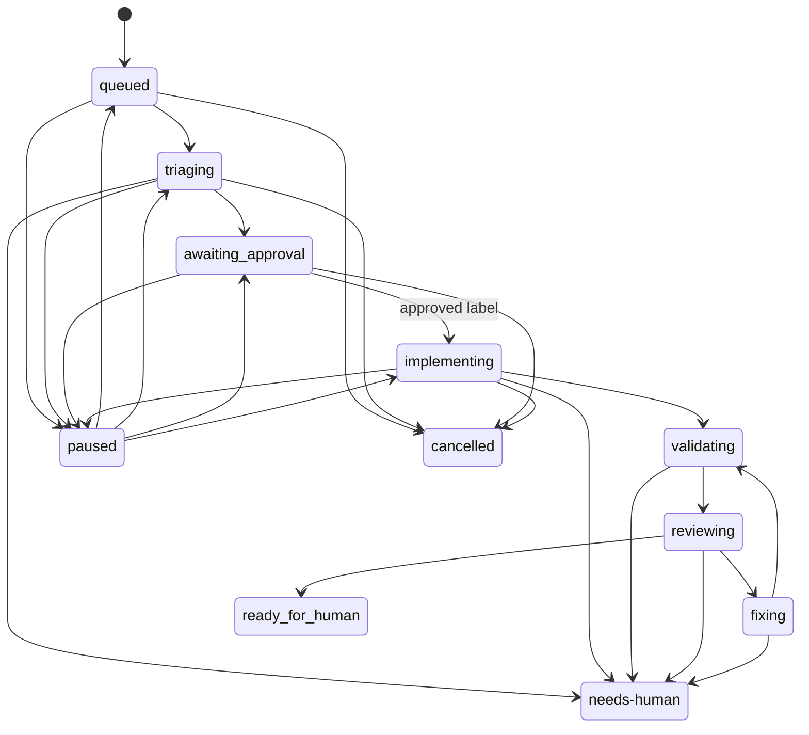

# Durable controller lifecycle

`Controller` in `src/openhands_controller/engine/controller.py` is the canonical workflow owner. It accepts durable `Event` records, applies transition rules from `domain/states.py`, records dispatch intent before external calls, and advances the remote adapter from a single-worker executor. [GitHub triage](../integrations/github-triage.md) supplies fork events; [runtime and workspaces](runtime-and-workspaces.md) implements the dispatched adapter.

The declared state graph includes the full intended delivery lifecycle. The current live delivery stops after implementation and moves to `needs-human`, rather than performing validation, review, or publication.

## Ordering and durable invariants

1. `handle` calls `Store.record_event`, skips an event whose outcome is already `processed`, applies it, then marks it processed. Event identity is therefore the replay boundary.
2. An issue event creates a workflow or, when title/body revision changes, requeues it and requests a revision stop for an active dispatch. A stale approval cannot apply to a changed revision.
3. Commands and label events are accepted only for the current revision and a `write`, `maintain`, or `admin` actor. The label path additionally requires an `added` `agent:implement` event timestamped no earlier than entry to `awaiting-approval`.
4. `tick` completes one pending adapter call or advances the one active dispatch; otherwise it schedules the first eligible workflow. SQLite's `one_active_dispatch` partial unique index is the durable backstop for `max_active == 1`.
5. An uncertain remote call, unknown/exhausted budget, invalid result, timeout, or exhausted correction route escalates to `needs-human` instead of guessing a safe continuation.

`StopRequest` separates revision, cancellation, pause, timeout, and iteration limits. A stop is requested in persistent workflow state, sent to the adapter, then confirmed by observation; cancellation and limits cancel the remote run, while pause does not. Resume is rejected when the prerequisite approval revision is stale, budget cost is unknown, or another dispatch is active.

## Change recipe: alter lifecycle behavior

Consult this page when a new state, command, transition, retry, timeout, or result action is proposed.

- Update `WorkflowState`, `ALLOWED`, `DISPATCH_ROLE`, `IDLE`, and `PRE_APPROVAL` together in `domain/states.py`; `check_transition` makes omissions observable.
- Trace `Controller._apply_event`, `_schedule_next`, `_advance`, `_observed`, and `_confirm_stop`. A state can be valid in the graph but unreachable unless scheduling or completion code owns it.
- Preserve durable ordering: persist intent/state before an external call, and use CAS/transition methods rather than an in-memory mutation.
- Keep terminal/escalation semantics conservative. If a remote identity cannot be reconciled, use `needs-human`; do not silently recreate a run.
- Add focused tests for initial state, authorized and unauthorized commands, duplicate/replayed events, revision while running, stop confirmation, resume prerequisites, and the one-active-dispatch constraint. `tests/test_commands.py` and `tests/test_dispatch.py` contain these behavioral seams; `test_owner_added_approval_label_starts_one_implementer_and_hands_off` in `tests/test_triage_service.py` covers the live-shaped approval handoff.

Run `uv run pytest tests/test_dispatch.py tests/test_commands.py -q`. Add `tests/test_triage_service.py` when intake or live wiring is involved. Do not run Docker or an authenticated model smoke for a pure state-machine change.
