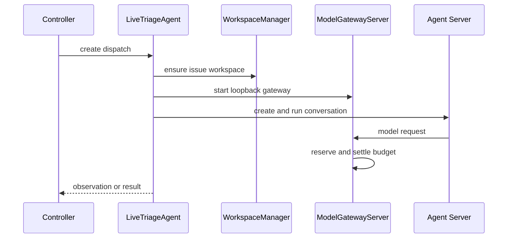

# OpenHands runtime and persistent workspaces

`LiveTriageAgent` is the adapter used by the [controller lifecycle](controller-lifecycle.md) when `AGENT_BACKEND=openhands`. For the active dispatch it ensures one persistent workspace, starts a loopback model gateway, and delegates conversation operations to `OpenHandsAdapter`. The runtime records model/profile facts and redacted event evidence that the [local console](../operations/local-console.md) can read without browser access to Agent Server credentials.

The controller serializes adapter calls, so this composition is for one active dispatch rather than a general parallel executor.

## Profiles, prompts, and model routes

`runtime/agents.py` is the single declaration point. `AGENTS` maps each `Role` to an `AgentProfile` containing a prompt file, explicit tool names, optional skill filenames, and an optional `ModelRoute`. `build_agent` reads only declared files from `runtime/agent_content/`, adds `common.md` plus role instructions to system context, and disables user, public, and project skills. Task-specific issue details and typed result shape remain in `runtime/prompts.py` and `domain/results.py`, rather than being embedded in the stable profile context.

The default route is `openai/gpt-5.6-terra`. A role override must provide positive finite conservative input/output USD-per-million-token rates. If `LLM_MODEL` differs from the default, every role must declare a priced route. Custom routes require provider-reported cost; only the default can use token fallback. The live agent installs `ModelRequestGate` per dispatch so request-level budget reservation and settlement use the selected route.

Tool selection constrains the SDK-visible tool set but is not a host write permission boundary: terminal access can still edit files. Triage and review instructions request no edits, but enforced read-only behavior must be implemented through workspace permissions, not assumed from prompts.

## Workspace identity and security boundary

`WorkspaceManager.identifier(issue)` derives the persistent identity before `Controller` writes a dispatch. `LiveTriageAgent._for` rejects a workspace if `ensure` returns a different identity. Workspaces are owned, labeled Docker Agent Server containers with storage under `WORKSPACE_DIR`; containers publish their Agent Server port only to `127.0.0.1` and mount only the controller-owned workspace storage.

`load_runtime_tokens` creates `STATE_DIR/runtime-auth.json` once with mode `0600`, rejects a symlink or non-private file, and reuses its Server and gateway tokens across restart. Workspace validation checks saved schema/SDK version, owner/auth hash, storage path, image digest, and container labels/image before reattaching. These boundaries keep credentials out of containers except the dedicated private auth file and keep controller recovery from adopting an unrelated container.

## Change recipes

### Add or revise an agent role

1. Add the role consistently to `Role`, lifecycle dispatch mapping, result schema/prompt behavior, and `AGENTS`; a declaration alone does not make it schedulable.
2. Name every prompt and skill file in the profile. `build_agent` intentionally does not discover arbitrary files.
3. Choose the smallest tool set and a priced `ModelRoute` if not using the default. Update profile snapshot behavior if profile inputs change.
4. Verify the actual SDK agent context, not just the dictionary: `tests/test_agent_profiles.py` asserts tools, instructions, skills, and disabled ambient skills. Add result/adapter tests where the role becomes dispatchable.
5. Run `uv run pytest tests/test_agent_profiles.py tests/test_model_config.py -q`; include `tests/test_openhands_adapter.py` if transport or accounting changes.

### Change workspace or live transport behavior

Follow `WorkspaceManager.ensure`, `_validate`, `_spec`, and `LiveTriageAgent._for` as one surface. Preserve deterministic issue identity, full immutable image digest, private token files, loopback publication, and reattach validation. Test fresh creation, reattach, mismatched storage/image/auth, cleanup/reuse, and dispatch identity using `tests/test_workspaces.py` and `tests/test_live_triage.py`.

Run `uv run pytest tests/test_workspaces.py tests/test_live_triage.py -q`. `controller qualify-runtime --image-digest ...` is an expensive authenticated Docker/OpenRouter check; use it only for an SDK, image, gateway, or live transport boundary change. It validates a shipped runtime boundary, whereas focused tests establish internal correctness.
