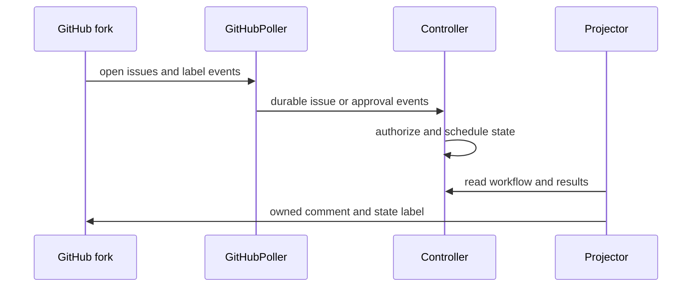

# GitHub fork triage integration

The live service is composed by `build_live_service` in `src/openhands_controller/triage.py`: `GitHubPoller` collects public fork facts, `Controller` owns workflow changes, and an optional `Projector` reflects controller-owned status back to GitHub. This integration dispatches into the [controller lifecycle](../architecture/controller-lifecycle.md), not directly into OpenHands. The controller's adapter and workspace boundary are documented in [runtime and workspaces](../architecture/runtime-and-workspaces.md).

This shows the poll-and-project loop. Projection is optional and never supplies authorization.

## Intake and approval contract

`GitHubPoller` stores `github-triage-start:<repo>` in SQLite at first startup, with a two-second overlap for GitHub's second-resolution timestamps. It lists open issues since that point, ignores pull requests, and excludes unknown issues created before the saved boundary. Known issues are replayed so edits can update a workflow. Event IDs include the fork, issue number, observation/revision, or immutable GitHub label-event ID; `Controller.handle` performs final deduplication.

An `agent:implement` label is an approval only when all conditions hold:

- GitHub reports a **labeled** action, not an already-present label or an unlabel action.
- The label event is within the persisted watch window and its actor is available.
- The event is added after the workflow entered `awaiting-approval`, targets the current issue revision, and the actor has repository `write`, `maintain`, or `admin` permission.

The projector is activated only by `GITHUB_WRITES_ENABLED`. It maintains one controller-owned status comment, projects one `agent:state:<workflow-state>` label while removing other state labels, and removes an approval label after consumption. It can also write a role-result comment for finished dispatches. It only adopts comments made by the authenticated token owner and escapes/bounds projected text. State labels communicate state; changing one does not invoke a role.

## Failure and timing behavior

`TriageService.step` calls `controller.tick()` even when polling throws, preserving active dispatch supervision during an API failure. In `run_forever`, `GitHubRateLimit` delays the next poll by the greater of the configured interval and retry-after time; controller ticks continue every second without a poll. Projection failures are logged except rate limits, which follow the same backoff path.

The current delivery is intentionally restricted: `TriageOnlyDelivery` stops after an implementation result and moves the workflow to `needs-human`. No GitHub draft PR is published and no candidate validation occurs.

## Change recipe: GitHub-facing behavior

Use this page for a new event type, label convention, API call, or projected output.

- Start at `GitHubClient` for fork normalization, pagination, upstream rejection, and rate-limit translation; do not construct ad hoc URLs in the poller or projector.
- Preserve the startup-boundary and immutable-event-ID replay contract in `GitHubPoller`. An event's original revision matters when an issue is edited later.
- Put authorization in `Controller._authorised_command`, not in the projector. Projection must remain observational and idempotent.
- For a new projected artifact, use an ownership marker and only modify artifacts attributable to the current authenticated login.
- Test read pagination/upstream rejection, initial and restarted polling, label timing/actor/revision, and idempotent projection in `tests/test_github_triage.py`. Test the real composition and rate-limit supervision in `tests/test_triage_service.py`.

Run `uv run pytest tests/test_github_triage.py tests/test_triage_service.py -q`. An actual fork run is conditional and requires configured credentials; it is not a default validation for parsing or projection changes.
