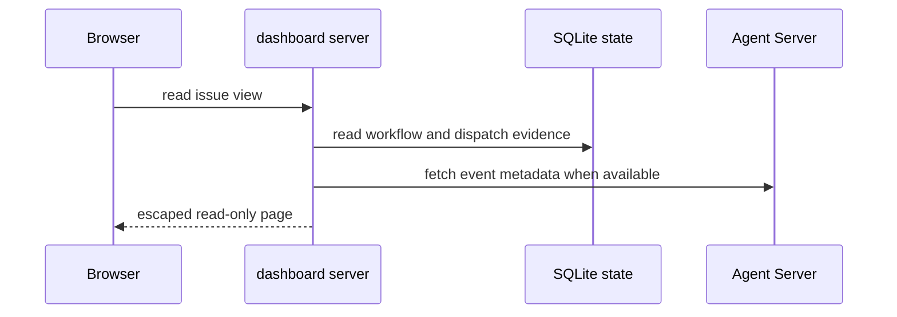

# Local performance console and run feedback

The console is a local evidence view over controller state, not a control plane. `controller dashboard` calls `make_dashboard_server` for `STATE_DIR/controller.sqlite`; the server binds to `127.0.0.1`, renders an HTML view, and supports no writes. `controller rate` separately calls `Store.rate_dispatch`. The console explains outcomes produced by the [controller lifecycle](../architecture/controller-lifecycle.md) and can request live workspace metadata through the guarded [runtime and workspaces](../architecture/runtime-and-workspaces.md) boundary.

The console process, not the browser, holds the Agent Server authentication material.

## Persisted evidence

`schema.sql` defines `workflows`, `dispatches`, `usage`, `run_history`, `feedback`, and `agent_events` among other controller tables. The dashboard's `PerformanceReader` uses a read-only SQLite URI and derives:

- workflow state/reason, state and dispatch history, validations, and workspace record;
- selected model plus profile hash, where the hash identifies a configuration rather than a result;
- settled charges per dispatch, with explicit unknown/open request counts; and
- elapsed time from first recorded `running` dispatch history to terminal dispatch history.

Older databases can lack newer attribution facts. The store migration path adds the necessary tables/columns when the dashboard opens an existing controller database; it does not make historical data appear. The runtime archives safe event labels after workspace cleanup because raw workspace event files are removed with the workspace.

## Privacy and input boundaries

`safe_event_metadata` and `normalise_events` retain only bounded event kind, source, tool label, and timestamp. They deliberately omit messages, commands, arguments, and results. `fetch_agent_events` validates conversation IDs, reads `runtime-auth.json` only in the local console process, sends its token to the loopback Agent Server, and returns normalized metadata. It also rejects unsafe workspace paths and oversized/symlinked archived event files. HTML is escaped and the server sends a restrictive content security policy.

Use `controller rate RUN_ID --rating useful|partly-useful|incorrect --note "..."` to replace a run's feedback. The rating command requires an existing database and dispatch; it does not schedule an agent, alter the workflow, or authorize an action.

## Change recipe: persistence or console fields

- Add controller-owned facts through `schema.sql` and `Store` migrations/queries first. Keep the dashboard reader read-only; it must not be the component that changes operational state.
- When exposing a runtime-derived field, reduce it to bounded inert metadata before persistence or rendering. Do not add raw prompts, tool arguments, results, or credentials to the browser view.
- Maintain loopback-only binding, write rejection, path/symlink checks, output escaping, and CSP when modifying HTTP behavior.
- Add a store test for restart/migration and attribution semantics in `tests/test_performance_store.py`; add HTTP boundary tests in `tests/test_performance_http.py`; use `tests/test_performance_dashboard.py` for rendered metric behavior.

Run `uv run pytest tests/test_performance_store.py tests/test_performance_http.py -q`. Run the dashboard manually only when modifying presentation or live Agent Server interaction; it is unnecessary for a pure schema/query unit change.
